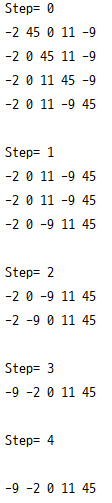

  
인접한 두 개의 원소를 비교하여 가장 큰 원소가 마지막 자리로 오게해서 숫자를 정렬하는 방법이다. 
한 번 과정을 거칠때마다 큰 수가 제일 뒤로 위치하게 된다.  
다음 탐색 부터는 마지막 요소를 제외하고 다시 탐색한다

시간 복잡도는 __O(n^2)__ 을 가진다.

```java
package org.sort;

public class BubbleSort {

    public static void bubbleSort(int[] list) {
        for (int i = 0; i < list.length; ++i) {
            System.out.printf("Step= %d\n", i);
            for (int j = 1; j < list.length - i; ++j) {
                if (list[j-1] > list[j]) {
                    int temp = list[j - 1];
                    list[j - 1] = list[j];
                    list[j] = temp;
                }
                for (int v = 0; v < list.length; ++v) {
                    System.out.print(list[v] + " ");
                }
                System.out.println();
            } // end for
            System.out.println();
        } // end for
    }

    public static void main(String[] args) {
        int[] list = {-2,45,0,11,-9};
        bubbleSort(list);
        for (int value : list) {
            System.out.print(value + " ");
        }

    }
}
```

[실행 결과]  
